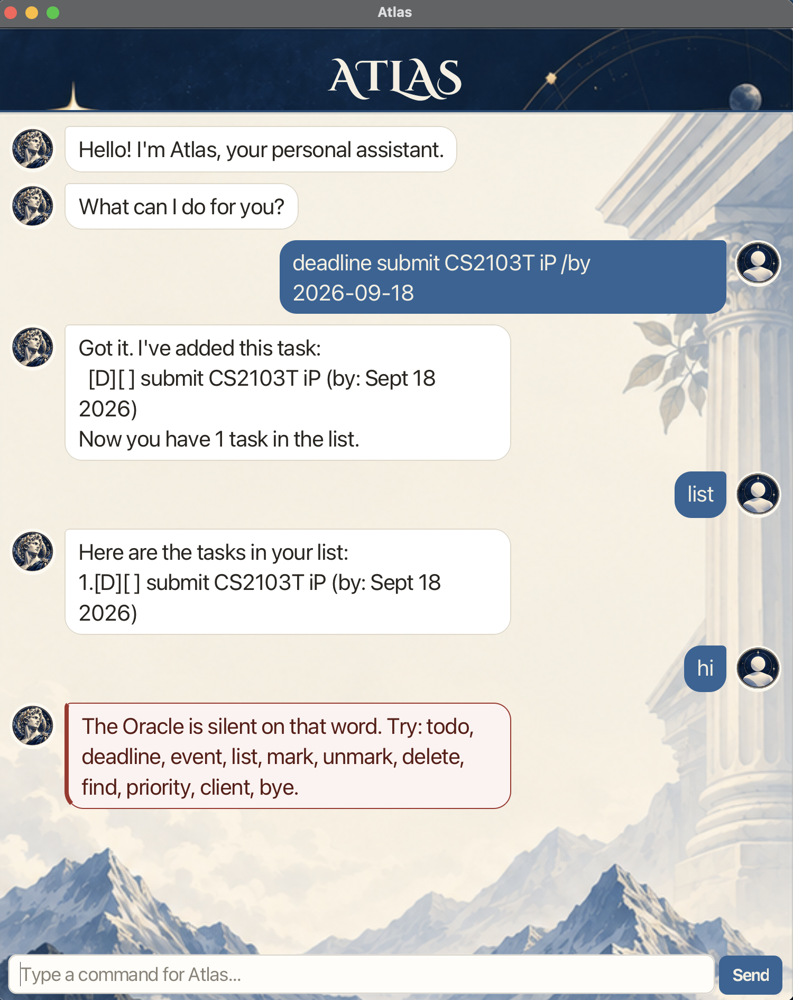

# Atlas User Guide



Atlas is a desktop assistant for keeping track of tasks and clients. You type a
command in the box at the bottom of the window, and Atlas answers in the chat.

## Adding tasks

Add a task with no date of its own:

```
todo buy groceries
```

Add one with a due date, written as `yyyy-mm-dd`:

```
deadline submit CS2103T iP /by 2026-10-15
```

Add one with a start and an end:

```
event CS2101 pitch rehearsal /from Mon 2pm /to 4pm
```

Expected outcome:

```
Got it. I've added this task:
  [D][ ] submit CS2103T iP (by: Oct 15 2026)
Now you have 1 task in the list.
```

`list` shows every task in the order you added them. `mark <number>`,
`unmark <number>` and `delete <number>` all use the numbers that `list` prints,
and `find <keyword>` narrows the list to the tasks whose description contains
the keyword.

## Managing clients

Atlas keeps track of your clients alongside your tasks. Each client has a name,
and may have a phone number and an email address.

Add a client, with the optional details in any order:

```
client add Mary Jane /phone 91234567 /email mary@example.com
```

Expected outcome:

```
Got it. I've added this client:
  [C] Mary Jane (phone: 91234567) (email: mary@example.com)
Now you have 1 client in the list.
```

`client list` shows every client in the order you added them:

```
Here are your clients:
1.[C] Mary Jane (phone: 91234567) (email: mary@example.com)
```

`client find <keyword>` searches names, phone numbers and email addresses, and
accepts several keywords at once:

```
client find mary
client find 9123 mary@example.com
```

`client delete <number>` removes a client, using the number shown by
`client list`:

```
client delete 1
```

Client numbers are independent of task numbers, so deleting a client never
changes how your tasks are numbered. Both are stored in the same data file.

## Setting priorities

Rank a task so that what matters first is visible at a glance:

```
priority 1 high
```

Expected outcome:

```
Noted. I've ranked this task:
  [T][ ][HIGH] buy milk
```

The level appears as a tag right after the status icon in `list` and `find`, and
only when a level is set:

```
Here are the tasks in your list:
1.[T][ ][HIGH] buy milk
2.[D][X][LOW] submit report (by: Oct 15 2019)
3.[E][ ] project meeting (from: 2pm to: 4pm)
```

The three levels are `high`, `medium` and `low`. Remove a level with `none`:

```
priority 1 none
```

```
Noted. I've cleared this task's rank:
  [T][ ] buy milk
```

The level is stored with the task, so it survives a restart, and a task without
a level is stored exactly as it was before this feature existed.

## Errors Atlas reports

Atlas answers every mistake with a message that says what was wrong, and never
changes your data when it rejects a command. A few cases are worth knowing:

- A missing part: `deadline` without `/by`, `event` without `/from` or `/to`, or
  a task command with no description. Each reply shows the syntax to use.
- A marker written twice, such as `client add Bob /phone 1 /phone 2`. Atlas
  rejects the command rather than storing the first number with the second
  marker stuck to it. The same applies to `/from`, `/to` and `/email`.
- An event that starts and ends at the same moment, such as
  `event vigil /from 2pm /to 2pm`. Atlas compares the two values only when both
  are plain clock times (`2pm`, `2:30pm`, `14:00` or `0900`), so free text such
  as `/from 7pm at marina` is left alone. An end later than the start is always
  accepted, because an event may run past midnight.
- Spaces before a command are ignored, so an accidentally indented line still
  works. Mistakes are shown in a bubble bordered with `!` marks, so they stand
  out from Atlas's ordinary replies. In the window, the same mistakes appear in
  a bubble with a red frame, so a rejected command is easy to spot in a long
  conversation.

If the data file is missing it is created on first use, so an empty file is
normal. If a file cannot be read, or holds a record Atlas cannot make sense of,
Atlas starts without that record, tells you which line it was, and keeps a copy
of the original file beside it as `atlas.txt.corrupted-<date>` before writing
anything, so records already in the file are never lost for good.

## Acknowledgements

The screenshot above and the rest of the interface artwork were generated with AI image tools. See the [project README](https://github.com/jarenyap/ip#acknowledgements) for the tools and libraries Atlas uses.

